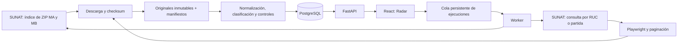

# Arquitectura y decisiones

## Flujo

## Unidad de análisis

Una operación es una declaración. Una fila analítica es una **serie**. Clave de negocio: país + régimen + aduana + año + número + serie, protegida por restricción UNIQUE de PostgreSQL. Los importadores se agrupan por RUC. La normalización de nombres sólo elimina acentos, normaliza mayúsculas y espacios; no fusiona sociedades parecidas.

Si una consulta web sólo informa RUC, se puede completar la razón social desde una fila MA con exactamente el mismo RUC. `_enrichment` conserva el identificador de operación y archivo que aportaron ese nombre; el dato web original sigue sin modificar.

`operations` guarda el estado normalizado actual y su original. `revisions` conserva cada variante original observada, incluso consultas de menor prioridad. `artifacts` conserva checksum, ruta, fuente, URL, período y descarga. `reviews` almacena autor declarado, motivo y cambios de clasificación; no constituye identidad autenticada en el modo local. `runs` es la cola e historial; `alerts` tiene una huella única para no repetir notificaciones.

Los objetos crudos se copian a rutas por SHA-256. Los ZIP no se extraen usando nombres arbitrarios: sólo se lee un miembro DBF y se copia a una ruta controlada con límite de tamaño. El navegador conserva HTML y la exportación original. No se consideran instrucciones los textos de las páginas descargadas.

## Consistencia e incrementalidad

Una transacción con advisory lock serializa cambios de series/revisiones/alertas. Los datos no cambian si el hash es igual. Revisiones con fecha de modificación anterior no reemplazan datos más recientes. La base MA tiene prioridad 20; la consulta web 10 porque trae menos campos y redondeo distinto. Un original de menor prioridad se conserva en revisiones aunque no reemplace la fila actual. Para conocer la última rectificación completa se debe volver a cargar la base oficial.

La versión del normalizador integra el hash de transformación; `reprocess` aplica cambios de reglas conservando originales, enlaces y clasificaciones humanas. Si cambia un esquema, falta una fecha, cambia el total durante paginación o aparece un control de acceso, la ejecución falla explícitamente. No se convierte un error de red en cero resultados.

La primera ejecución toma una línea base fija para todos sus archivos. No crea alertas sobre el histórico inicial; las posteriores comparan fechas mayores al máximo ya observado. Se limita a nuevas operaciones dentro de la cobertura: una declaración tardíamente observada con fecha antigua puede no generar alerta. Se evita así interpretar backfills como arribos nuevos. Las variaciones comparan series con descripción literal, subpartida, importador, origen y proveedor iguales; no son equivalencia técnica ni volumen mensual comparable.

## Reglas de medidas y valores

- Peso neto de la serie MA/web en kg como fuente principal; en ausencia, factores explícitos KG/KGM, TM/TNE, G/GRM y LB internacional.
- No se infieren pesos por bolsas, bultos, litros o volumen, ni usando un peso mencionado en una descripción sin correspondencia verificable.
- FOB, flete y seguro de la misma serie en USD. CIF = suma si los tres están presentes y no son negativos.
- FOB/kg exige FOB > 0 y kg > 0. El ponderado agrega sólo series con ambas medidas comparables; no divide universos distintos.
- No se convierte moneda desconocida a USD. Las fuentes implementadas etiquetan sus importes como dólares.
- Países ISO normalizados con pycountry; códigos nulos/desconocidos siguen faltantes. Origen y adquisición son campos diferentes.
- PE de baja densidad no se divide automáticamente entre LDPE y LLDPE por una subpartida compartida. EVA/PETG no se equiparan a PE/PET.
- Productos candidatos por descripción requieren contexto arancelario químico/plástico para reducir falsos positivos, por ejemplo jugos concentrados.

## Cobertura

El rango mínimo/máximo de numeración es el de las series efectivamente presentes, **no evidencia de continuidad ni totalidad**. Las ventanas exactas, parámetros de consulta y errores se ven en Fuentes y calidad. Las semanas incompletas no se completan con ceros ni se presentan como variación de mercado.

El modo `plastics` filtra al extraer; el modo `all` permite cargar todos los rubros de un archivo semanal. Los filtros de interfaz permiten ver el catálogo o todos los registros almacenados. La implementación actual mantiene el conjunto seleccionado de un DBF en memoria para resolver versiones y el cruce MB. Para cargas nacionales multianuales, evolucionar a tablas staging, COPY, almacenamiento de objetos y workers particionados. No se ha validado rendimiento a esa escala.

## Operación local

El worker separado es necesario para que Actualizar datos procese la cola. Un advisory lock de proceso impide dos workers simultáneos. No se activa una programación automática sin definir su periodicidad; se puede ejecutar la CLI mediante el programador elegido por el operador. Los archivos semanales desaparecen del portal tras el horizonte anunciado, por lo que conviene conservarlos.

Respaldo: `pg_dump` más `data/raw`. Las rutas actuales son absolutas para los archivos originales; al trasladar el almacenamiento, actualizar `artifacts.path` conservando hashes. En Docker todos los servicios comparten `/app/data/raw`, por lo que no cambia la ruta al recrearlos.

No hay credenciales SUNAT ni evasión de CAPTCHA. La consulta detallada probada no pidió autenticación; el enlace individual a la DUA sí presenta CAPTCHA. Los servidores HTTP antiguos carecen de cifrado de transporte: el checksum protege integridad local, no acredita autenticidad criptográfica del origen.
